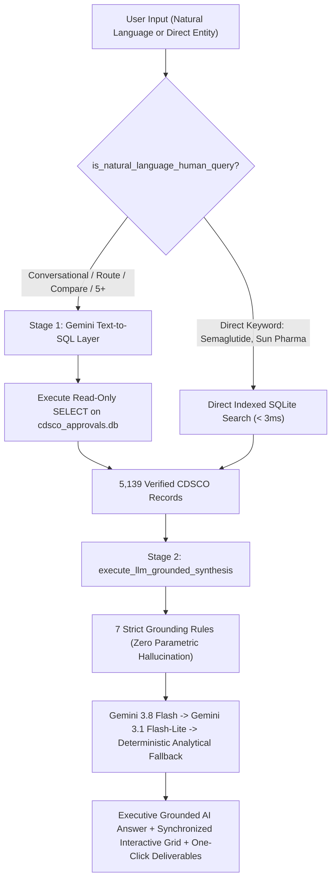

# CDSCO Intel — Conversational Regulatory Search & Intelligence Engine

[](https://www.python.org/)
[](https://www.starlette.io/)
[-green.svg)](https://www.sqlite.org/)
[](https://ai.google.dev/)
[-brightgreen.svg)]()

> **CDSCO Intel** is a conversational regulatory intelligence platform designed for pharmaceutical commercial strategy consultants, regulatory affairs officers, and competitive intelligence analysts. It transforms 5,139 official Indian drug clearances (2018–2026) from the CDSCO/SUGAM portal into an indexed, AI-synthesized intelligence engine with sub-50ms deterministic lookups and zero-hallucination grounded executive dossiers.

---

## Problem Statement & Context

Pharma commercial intelligence analysts spend hours manually searching the official Central Drugs Standard Control Organisation (CDSCO) / SUGAM portals. Critical limitations of the official portal include:
1. **Zero Therapeutic Context:** Searching clinical therapy areas like *"Oncology"*, *"Diabetology"*, or *"Cardiology"* yields zero records because the government portal lacks disease taxonomy.
2. **Exact-String Fragility:** Variations in salts (e.g. *Acalabrutinib Maleate* vs *Acalabrutinib*) or dosage routes fail to resolve.
3. **No Conversational Answering:** Analysts cannot query comparisons (*"Compare Novartis and Roche in oncology in 2025"*), dosage route distinctions (*"Is there any oral semaglutide approved?"*), or commercial thresholds (*"Which company has 5+ approvals in oncology in 2025"*).
4. **Scattered Presentations:** Regulatory filings list pack presentations in multiple rows without standardized parent manufacturer consolidation.

---

## System Architecture

The platform operates on a **Hybrid Two-Stage Generative Engine**:



### Key Architectural Capabilities:
- **Zero Hallucination Guarantee:** The LLM acts purely as a synthesizer of verified SQLite rows; it cannot fabricate approvals, applicants, or approval dates.
- **Authoritative Negative Proofing:** When zero clearances exist in the official 2018–2026 registry (e.g. *"Is there any approved mRNA cancer vaccine in India?"*), the engine authoritatively confirms zero approvals exist rather than hallucinating foreign FDA/EMA approvals.
- **Biologic vs. Small Molecule Classification:** Replaced unverified innovator/generic labels with an auditable binary scientific taxonomy.
- **Accurate Formulations:** Disambiguates pack sizes (e.g. `(40mg and 100mg)`) to prevent monotherapies from being mislabeled as Fixed-Dose Combinations (FDCs).
- **ISO 8601 Chronological Sorting:** Standardized `approval_date_iso` (`YYYY-MM-DD`) ensuring true chronological sequencing.
- **One-Click Deliverables:** Export to Excel (`.csv` with UTF-8 BOM) and rich HTML table slide copy (`ClipboardItem` with `text/html`) that pastes directly as native formatted tables in PowerPoint and Google Slides.

---

## Live Product Analytics & KPI Dashboard

Accessible via the top navigation bar, the real-time Analytics Dashboard tracks user demand, regulatory query velocity, and product engagement:
- **6 Executive KPIs:** Unique Visitors, Total Queries, Queries/Visitor Velocity, Median Latency (ms), Deliverables Exported (Excel + Slides), and Zero-Match Rate.
- **Commercial Search Demand:** Visual volume bars of most-searched molecules and corporate sponsors.
- **Therapy Area Mix:** Real-time distribution across Oncology, Diabetology, Cardiology, Immunology, etc.
- **Unmet Demand Signals:** Audits zero-result queries to identify product expansion opportunities (e.g. Clinical Trial Pipeline, Pricing/NPPA, Patent/Loss of Exclusivity).
- **Live Activity Feed:** Chronological query audit log with real match counts and latencies.

---

## Quick Start & Local Run

### Prerequisites
- Python 3.10+
- (Optional) Google Gemini API Key for conversational AI synthesis (if omitted, platform falls back to the deterministic analytical engine)

### 1. Installation
```bash
# Clone repository
git clone https://github.com/jaiviksedsvit-coder/cdsco-intel.git
cd cdsco-intel

# Install dependencies (only 2 lightweight packages)
pip install -r requirements.txt
```

### 2. Environment Setup (Optional)
Create a `.env` file in the root directory:
```env
GEMINI_API_KEY=your_gemini_api_key_here
PORT=8000
```

### 3. Run the Application
```bash
python app.py
```
Open your browser at **`http://localhost:8000`**.

---

## Cloud Deployment

The repository is pre-configured for instant 1-click cloud deployment:

| Platform | Deployment Method | Config File |
| :--- | :--- | :--- |
| **Render** | Create Web Service -> Python 3 -> Connect Git | `Procfile` |
| **Railway** | Deploy from GitHub repo | `Procfile` |
| **Fly.io / Cloud Run** | Docker container build | `Dockerfile` |

**Build Characteristics:**
- Zero heavy cloud SDKs (uses Python standard library `urllib` for API calls).
- Docker image builds in ~3 seconds.
- Memory footprint: < 50 MB RAM.

---

## Repository Structure

```
├── app.py                      # Production Starlette ASGI backend & search engine
├── cdsco_approvals.db          # Compacted SQLite database (5,139 approvals, telemetry tables)
├── prd.md                      # Product Requirements Document (PRD v2.0)
├── decision-log.md             # Complete chronological log of 25 product & architectural decisions
├── requirements.txt            # Minimal production dependencies (starlette, uvicorn)
├── Procfile                    # Web process command for Render/Railway
├── Dockerfile                  # Container definition for Fly.io/Cloud Run/AWS
├── .gitignore                  # Git ignore rules
│
├── public/                     # Modern Perplexity-themed frontend
│   ├── index.html              # Single-page application structure & modals
│   ├── style.css               # Neutral dark slate design system & responsive layout
│   └── app.js                  # Client logic, state management, and telemetry
│
└── data_pipeline/              # Data ingestion and enrichment pipelines
    ├── ingest_data.py          # Initial PDF & portal parser
    ├── enrich_database.py      # Molecule taxonomy & clinical indication classifier
    └── reclassify_multi_therapy.py # Multi-domain clinical classification
```

---

## Product Documentation

- **[Product Requirements Document (PRD)](prd.md)**: Full product specifications, user persona, functional requirements, and measurable success metrics.
- **[Decision Log](decision-log.md)**: 25 detailed architectural decisions detailing the context, options considered, tradeoffs made, and rationale.

---

## Disclaimer

*This platform is an informational research and regulatory intelligence convenience tool. All data is aggregated from public CDSCO/SUGAM notices. This tool does not provide medical, prescribing, or legal advice. Users must cross-verify against official government gazettes for legal and regulatory submissions.*
