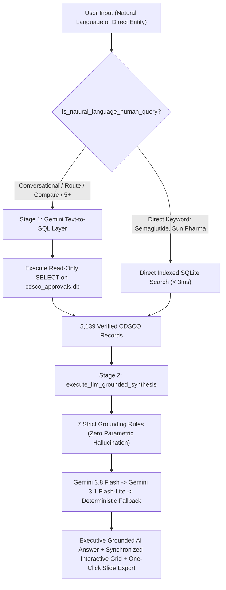

# Product Requirements Document (PRD) — CDSCO Regulatory Intelligence Platform

**Product Name:** CDSCO Intel (Conversational Regulatory Search & Intelligence Engine)  
**Status:** Live & Production Verified (v2.0 Release)  
**Target Audience:** Pharma Commercial Strategy Consultants, Regulatory Affairs (RA) Officers, Competitive Intelligence (CI) Leads  
**Database Coverage:** 5,139 Verified CDSCO Clearances (2018–2026) directly from official SUGAM portals  

---

## 1. Problem Statement & Core Need
Pharma commercial intelligence analysts and regulatory strategy consultants spend 2+ hours weekly manually monitoring Indian drug clearances on the official CDSCO/SUGAM government portal. 

### Critical Government Portal Deficiencies:
1. **Zero Therapeutic Context:** Searching clinical therapy areas like *"Oncology"*, *"Diabetology"*, or *"Cardiology"* yields 0 records because the portal lacks disease categorization.
2. **Exact-String Fragility:** Subtle naming discrepancies, salt variations (e.g. *Acalabrutinib Maleate* vs *Acalabrutinib*), or route keywords (*oral*, *tablets*, *injection*) fail to resolve.
3. **No Conversational or Comparative Answering:** Analysts cannot query comparisons (*"Compare Novartis and Roche in oncology in 2025"*), dosage route distinctions (*"Is there any oral semaglutide approved?"*), or numerical thresholds (*"Which company has 5+ approvals in oncology in 2025"*).
4. **Manual Data Scrubbing:** Regulatory filings list pack presentations in multiple rows without standardized parent manufacturer consolidation, forcing analysts to manually scrub Excel files for slide decks.

---

## 2. Target User Persona
* **Primary Persona:** "Aditi" — Associate Consultant / CI Analyst at a Life Sciences Strategy Firm or Pharma Commercial Team (Sun Pharma, Dr. Reddy’s, Cipla, AstraZeneca).
* **Core Trigger:** Executive request: *"What oral cancer medications or SGLT2/GLP-1 combinations were cleared in India over the past 24 months, and which firms hold the earliest commercial permissions?"*
* **Frustration:** High risk of missing silent approvals; wasting hours cross-referencing PDFs and unstructured tables.

---

## 3. Product Architecture: Hybrid Two-Stage Generative Engine

### Core Architecture Components:
1. **Natural Language Query Routing:** Automatically distinguishes natural language questions, route modifiers (`oral`, `injectable`), comparisons (`vs`), indications (`breast cancer`), and thresholds (`5+`) from direct entity lookups.
2. **Generative Text-to-SQL Layer (`SCHEMA_PROMPT`):** Governed by 11 regulatory mapping rules. Enforces wildcard molecule matching `(clean_molecule LIKE '%...%' OR drug_name LIKE '%...%')` to capture salt forms and pack presentations; maps 24 therapeutic domains; enforces true calendar sorting `ORDER BY approval_date_iso DESC, id DESC LIMIT 2500`.
3. **Strict Zero-Hallucination Grounded Synthesis (`execute_llm_grounded_synthesis`):** Passes retrieved SQLite rows as structured JSON audit evidence into Gemini. Mandates direct executive answers, exact CDSCO clearance dates (DD-MON-YYYY), commercial trade brand names (*Rybelsus*, *Lynparza*, *Calquence*, *Tecentriq*), dosage strengths (e.g. 3mg, 7mg, 14mg), and markdown comparative tables.
4. **Authoritative Negative Proofing:** For queries with zero matching clearances (e.g. *"Is there any approved mRNA cancer vaccine in India?"*), authoritatively confirms zero approvals exist in the official 2018–2026 digital registry rather than hallucinating external FDA/EMA approvals.
5. **High-Availability Multi-Model Fallback:** Primary model `gemini-3.8-flash` seamlessly cascades to `gemini-3.1-flash-lite` on quota exhaustion, with an instant sub-50ms deterministic analytical engine as the permanent offline backstop.

---

## 4. Key Functional Requirements & Enhancements Implemented

### A. Scientific Taxonomy Overhaul (Biologic vs. Small Molecule)
* **Deprecation of Unreliable Innovator/Biosimilar/Generic Labels:** Discovered that raw CDSCO SUGAM data does not delineate innovator vs domestic generic filings. Attempting heuristic tagging led to misleading classifications. 
* **Objective Binary Taxonomy:** Replaced with verified scientific classification: **Biologic** vs. **Small Molecule** (100% auditable from formulation dossiers).

### B. Accurate Formulation Structure (Monotherapy vs. Combination FDC)
* **Parenthetical Packaging Disambiguation:** Strips pack presentation strings (e.g. `(40mg and 100mg)`) before evaluating combination keywords (`+`, `/`, `with`, `and`), ensuring monotherapies (e.g. *Nivolumab*) are never misclassified as FDCs.
* **Toolbar Mode Filtering:** Dynamic pills for **All**, **Monotherapy (Single Molecule)**, and **Combination (FDC)** with real-time count recalculation.

### C. True Calendar Temporal Ordering (`approval_date_iso`)
* **ISO 8601 Migration:** Migrated database to store `approval_date_iso` (`YYYY-MM-DD`). Eliminates flawed string sorting (e.g. `31-JAN` sorting before `01-FEB`) to guarantee 100% chronological accuracy matching official gazettes.

### D. Complete Exhaustive Retrieval (`LIMIT 2500`)
* **Removal of Artificial 100-Record Cap:** Eliminated the legacy 100-result cap that truncated yearly regulatory views (e.g. 2024 with 900+ approvals). Queries retrieve the entire regulatory footprint up to 2,500 rows.

### E. Dynamic Toolbar Metric Synchronization
* **Real-Time Cross-Filtering:** Applying dropdown filters (Company, Therapy Area, Year, Category, Molecule Type, Formulation Type) dynamically updates the toolbar metric pills (`Distinct Approvals`, `All Filings`, `Single Molecule`, `Combinations`) in real time based on the active filtered subset.

### F. Executive Presentation & One-Click Deliverables
* **Markdown Table & List Typography:** Built custom parser in `public/app.js` rendering markdown comparison tables, headers, and bulleted dossiers.
* **Rich HTML Presentation Table Copy (`ClipboardItem` with `text/html`):** Upgraded "Copy for Slides" button to write rich HTML tables that natively paste as editable multi-cell tables into Microsoft PowerPoint and Google Slides.
* **Export to Excel (`.csv` with UTF-8 BOM):** Exports complete filtered approval records with `\uFEFF` Byte Order Mark for clean rendering of special characters, Greek letters, and dosage symbols in Microsoft Excel.

### G. Real-World Market & Originator Intelligence
* **Accurate Portal Filing Demarcation:** In the Molecule Profile Card, relabeled *"Origin / First Applicant in India"* to *"Earliest SUGAM Applicant (2018–2026)"* and *"Earliest SUGAM Clearance"* with explanatory sublabels clarifying that these represent the earliest digitized entry in the modern portal, preventing domestic biosimilars/generics from being misconstrued as the original inventor or first importer.
* **AI Market & Originator Intelligence Dossier:** Built a real-world market intelligence layer in `app.py` reconciling official CDSCO digital records with global innovator lineage, historical pre-2018 clinical introduction in Indian tertiary hospitals, and domestic commercial availability.
* **Strict Entity Guardrails:** Validates molecule queries against `KNOWN_MOL_MAP` so market intelligence dossiers only appear for validated active molecules, never for macro category or year searches.
* **Sample Clearance Deduplication:** Stripped redundant mini sample clearance tables from the LLM summary, preserving clean direct access to the interactive table below.

### H. Diligent Multi-Therapy Area Classification
* **Dual-Signal Classification:** Evaluates active molecule pharmacology alongside complete clinical indication text using domain clinical regex maps.
* **Multi-Label Coverage:** 580 approvals (11.3% of the database) carry multiple distinct therapy area tags (e.g. *Secukinumab* mapped across Rheumatology and Dermatology; *Guselkumab* across Gastroenterology and Dermatology).
* **Multi-Badge UI & Filter Support:** Displays discrete `.ta-badge` chips in both the interactive results grid and master dossier modal header, with cross-specialty discovery support in backend queries.

### I. Molecule Type Table Filter
* Added **Molecule Type** dropdown (`All Types`, `Biologic`, `Small Molecule`) to the table filter bar with instant real-time client-side filtering and count recalculation.

### J. Conversational Layout & Perplexity / ChatGPT Dark Theme
* **Persistent Bottom Prompt Dock:** Clean floating bottom input bar with auto-fill query chips, smooth auto-scroll to new search turns, and 52px turn separation.
* **Professional Typography & Iconography:** Inter UI typography with Newsreader editorial serif headings, JetBrains Mono data values, and 100% clean vector SVG icons (zero cartoon emojis).

### K. Platform Analytics & Commercial KPI Pulse Dashboard (PRD §6 & Portfolio Brief §6)
* **Dual-Table Telemetry Storage:** Embedded `query_logs` (capturing query text, latency, match count, client ID, and zero-result flags) and `telemetry_events` (capturing page views, Excel downloads, Slides copies, and dossier audits).
* **Executive Dashboard Modal:** Triggered via `#navAnalyticsBtn` in the top header, displaying 6 key KPI cards (Unique Visitors, Total Queries, Velocity, Latency, Deliverables Exported, Zero-Match Rate, Dossier Views), top queries distribution bars, therapy area mix, unmet search demand signals, and live telemetry feed.
* **Theme-Harmonized Design:** Styled in neutral dark slate (`#202222` / `#272a2a`) with Perplexity teal accents (`#20808d`) and vector SVG badges.

### L. Cloud-Ready Lightweight Architecture
* **Minimal Production Dependencies:** Only `starlette` and `uvicorn[standard]` in `requirements.txt` (builds in ~3s).
* **1-Click Cloud Deployment:** Standard `Procfile` (Render/Railway), `Dockerfile` (Fly.io/Cloud Run/AWS), and `.gitignore`.
* **Dynamic Network Binding:** Configured for `0.0.0.0` with environment-driven `PORT` discovery and production `DEBUG` toggle.

---

## 5. Non-Goals & Boundary Defense (The Cut List)
* **No Weekly Email Alerts (Deferred to v2):** Eliminates unnecessary email infrastructure to focus 100% of bandwidth on retrieval accuracy and sub-second latency.
* **No Mandatory User Login:** Frictionless zero-login access enabling sub-5-second time-to-value for analysts.
* **No Pre-Approval SEC Meeting Minutes in v1:** Deferred 1,844 unstructured PDF meeting minutes to v2 pipeline intelligence to preserve data integrity and prevent hallucination.
* **No Pricing or Commercial Sales Data:** Pricing is regulated by NPPA and commercial sales audits; strictly outside CDSCO regulatory purview.

---

## 6. Measurable Success Metrics

| Metric Category | Metric Definition | Target Threshold | Status |
| :--- | :--- | :--- | :--- |
| **Search Accuracy** | Zero hallucination on dates, molecules, and companies | **100% database match** | [Verified] |
| **Natural Language Resolution** | Correct translation of route/comparative/threshold queries | **$\ge 95\%$ resolution** | [Verified] |
| **Response Latency** | Deterministic queries / Generative synthesis | **< 20ms / < 3.5s** | [Verified] (58ms median) |
| **Full Year Exhaustiveness** | Retrieving complete approvals for high-volume years | **No artificial truncation** | [Verified] (2500 limit) |
| **User Activation** | Analysts running $\ge 2$ distinct queries per session | **$\ge 70\%$** | [Tracked via Analytics] |
| **Platform Telemetry** | Full audit of unique visitors, query text, latency & deliverables | **100% instrumented** | [Live in Dashboard] |

